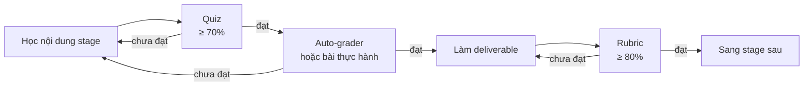

# Hệ thống bài tập & tự chấm

Mỗi stage có bài tập ở **3 lớp**, đo ba năng lực khác nhau. Làm đủ cả ba mới coi là qua stage.

| Lớp | Đo cái gì | Chấm thế nào | Có ở stage |
|---|---|---|---|
| **1. Quiz** | Hiểu khái niệm, nhận diện bẫy | Tự động trên trang web, có giải thích từng câu | 1–6 |
| **2. Auto-grader** | Viết được code chạy đúng | Script local so kết quả với đáp án tham chiếu | 2 (SQL), 4 (Pandas) |
| **3. Rubric** | Chất lượng deliverable | Tự tick, tính điểm tự động | 1–6 |

:::tip Vì sao cần cả ba
Quiz đúng hết mà không viết nổi query là biết lý thuyết suông. Code chạy đúng mà README không ai hiểu thì không qua được vòng phỏng vấn. Rubric bắt bạn tự soi phần mà máy không chấm được: cách trình bày, tính trung thực, mức độ hữu ích cho người đọc.
:::

---

## Lớp 1 — Quiz trắc nghiệm

Nằm ngay trong trang bài tập của từng stage. Bấm **Chấm điểm** để xem đúng/sai kèm giải thích. Đáp án được lưu trong trình duyệt nên đóng tab mở lại vẫn còn.

**Ngưỡng đạt: 70% số câu.** Chưa đạt thì đọc phần giải thích ở các câu sai, quay lại đúng mục trong stage, rồi làm lại — đừng đoán bừa cho qua.

Câu hỏi không hỏi định nghĩa thuộc lòng mà hỏi **tình huống có bẫy** — đúng dạng hay gặp khi phỏng vấn và khi đi làm.

---

## Lớp 2 — Auto-grader chạy local

Bộ chấm tự động cho SQL và Pandas. Chấm theo **kết quả trả về**, không chấm cách viết — nhiều cách giải khác nhau đều được điểm.

### Cài đặt (1 lần, ~2 phút)

```bash
git clone https://github.com/lhoanghai1912/da-roadmap.git
cd da-roadmap/exercises
python3 -m venv .venv
.venv/bin/pip install -r requirements.txt
.venv/bin/python setup_db.py
```

`setup_db.py` sinh `practice.duckdb` bằng seed cố định — mọi người có cùng dữ liệu, cùng đáp án.

| Bảng | Dòng | Bẫy cài sẵn |
|---|---|---|
| `customers` | 300 | 30 khách chưa từng mua → luyện anti-join |
| `products` | 80 | |
| `orders` | 2.000 | ~55 đơn có `customer_id` NULL → **bẫy `NOT IN`** |
| `order_items` | ~6.000 | Nhiều dòng/đơn → **bẫy fan-out**; vài `unit_price` bất thường → luyện outlier |
| `events` | ~2.000 | Phễu view → cart → checkout → purchase, có cột device |

### Chạy

```bash
# Stage 2 — SQL, 15 câu
.venv/bin/python stage2_sql/grade.py --init    # tạo file đề trống
# viết bài vào stage2_sql/answers/q01.sql ...
.venv/bin/python stage2_sql/grade.py           # chấm tất cả
.venv/bin/python stage2_sql/grade.py q05       # chấm 1 câu

# Stage 4 — Pandas, 12 bài
# viết code vào stage4_python/tasks.py
.venv/bin/python stage4_python/grade.py
```

### Grader báo lỗi cụ thể, không chỉ "sai"

```text
[FAIL] q06 (W5 · Medium)
       Lech gia tri tai dong 1, cot 'total_shipping': bai lam = 22,158.75, can = 7,274.05
       Goi y: Khong JOIN order_items o day. Neu JOIN, moi don bi nhan len theo
              so san pham va phi ship bi cong nhieu lan.

[FAIL] q02 (W4 · Easy)
       Ten cot khong khop.
       Bai lam: ['status', 'cnt']
       Can:     ['status', 'n_orders']
```

Đây chính là cách một senior review query của bạn: chỉ ra con số lệch ở đâu và vì sao, chứ không chỉ nói "sai".

:::warning Đừng mở file lời giải sớm
`solution_reference.py` và phần `reference` trong `questions.py` chứa đáp án. Mở ra trước khi tự làm là mất toàn bộ giá trị bài tập. Sai thì đọc gợi ý, quay lại tài liệu, sửa, chấm lại.
:::

---

## Lớp 3 — Rubric chấm deliverable

Máy không chấm được dashboard đẹp hay README rõ. Rubric giải quyết phần đó: danh sách tiêu chí cụ thể, tick từng mục, điểm tự cộng.

| Điểm | Kết luận |
|---|---|
| < 60% | Chưa đạt — làm lại |
| 60–79% | Gần đạt — bổ sung phần thiếu |
| ≥ 80% | Đạt — đưa vào portfolio |

Chấm **trung thực**. Rubric này không ai kiểm tra ngoài bạn — tự cho điểm rộng tay chỉ khiến bạn phát hiện lỗ hổng ở vòng phỏng vấn thay vì ở nhà.

---

## Thứ tự làm trong mỗi stage



---

## Trang bài tập theo stage

| Stage | Nội dung bài tập |
|---|---|
| [Stage 1](/bai-tap/stage-1) | Quiz 10 câu · 6 bài tính tay có kiểm tra số · Rubric sheet Superstore |
| [Stage 2](/bai-tap/stage-2) | Quiz 12 câu · **Auto-grader 15 câu SQL** · Rubric CHECKPOINT 2 |
| [Stage 3](/bai-tap/stage-3) | Quiz 10 câu · 5 bài thiết kế dashboard · Rubric Portfolio #1 |
| [Stage 4](/bai-tap/stage-4) | Quiz 10 câu · **Auto-grader 12 bài Pandas** · Rubric Portfolio #2 |
| [Stage 5](/bai-tap/stage-5) | Quiz 12 câu · 5 bài tính toán thống kê · Rubric Portfolio #3 |
| [Stage 6](/bai-tap/stage-6) | Quiz 10 câu · 3 case study · Rubric Capstone + CHECKPOINT 4 |
