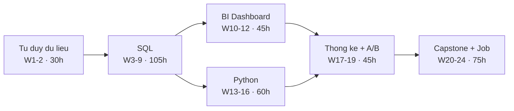

# Bản đồ 24 tuần — học gì, làm gì

Trang này để **nhìn toàn cảnh trước khi lao vào chi tiết**. Mỗi dòng dẫn tới trang chi tiết có task ID + checkbox.

| Lớp tài liệu | Dùng lúc nào |
|---|---|
| **Bản đồ này** | Định hướng, xem mình đang ở đâu, tuần sau làm gì |
| [7 Stage](/stages) | Trong tuần — task có ID, checkbox, deliverable |
| [Lý thuyết](/ly-thuyet) | Đầu tuần (hiểu) + cuối tuần (tự chấm bằng đáp án) |
| [Bài tập](/bai-tap) | Cuối stage — quiz, bài tính tay, rubric |

---

## Toàn bộ 25 tuần trên một bảng

| Tuần | Stage | Học gì | Làm ra gì |
|---|---|---|---|
| W0 | Setup | Cài duckdb · uv · docker · dbeaver · git | Môi trường chạy + repo portfolio có commit |
| W1 | Nền tảng | Grain · kiểu dữ liệu · NULL · khóa · `SUMIFS`/`XLOOKUP` · Pivot · MoM | Sheet 3 tab: raw · clean · pivot |
| W2 | Nền tảng | mean/median · percentile · IQR & outlier · tương quan · chọn chart | Tab `stats-summary` + **CHECKPOINT 1** |
| W3 | SQL | `SELECT/WHERE/ORDER BY` · `LIKE/IN/IS NULL` · thứ tự thực thi | 15 bài + 10 query Chinook |
| W4 | SQL | `GROUP BY/HAVING` · `COUNT(*)` vs `COUNT(col)` · aggregate có điều kiện | 20 bài + 10 query |
| W5 | SQL | JOIN 6 loại · anti-join · **bẫy LEFT JOIN+WHERE** · **fan-out** | 20 bài + 12 query · metric: DAU |
| W6 | SQL | subquery · correlated · `EXISTS` vs `IN` · **`NOT IN`+NULL** · CTE | 20 bài + 8 query · metric: Conversion rate |
| W7 | SQL | window: `ROW_NUMBER/RANK` · `LAG/LEAD` · running total · frame · `NTILE` | 20 bài + 10 query · metric: AOV |
| W8 | SQL | `DATE_TRUNC` · calendar table · `CASE WHEN` pivot · `COALESCE/NULLIF` | **Bộ 12 query báo cáo tháng** · metric: Retention D7 |
| W9 | SQL | funnel · cohort · RFM · `QUALIFY` · BigQuery, bytes scanned | 3 query lớn + **CHECKPOINT 2** · metric: Churn |
| W10 | BI | Looker Studio: dimension vs metric · 8 chart · calculated field · 3 cấp filter | Dashboard 1 trang, link public |
| W11 | BI | Metabase (Docker) · SQL có tham số · model · **star schema** · date dimension | 6 question + 1 dashboard + sơ đồ star schema |
| W12 | BI | Nguyên tắc thiết kế · thứ tự đọc · màu · mốc so sánh | **PORTFOLIO #1** — Sales Dashboard + README |
| W13 | Python | list/dict · hàm + type hint · comprehension · `try/except` · Jupyter | 15 bài tập Python |
| W14 | Python | `loc/iloc` · `groupby.agg` · `transform` · `merge` · `pivot_table` | Làm lại 10 query SQL bằng pandas, khớp số |
| W15 | Python | missing (vì sao thiếu?) · trùng theo khóa nghiệp vụ · chuẩn hóa · outlier | Notebook cleaning có **log trước→sau** |
| W16 | Python | matplotlib/seaborn 5 chart · heatmap · quy trình EDA 6 bước | **PORTFOLIO #2** — EDA Olist + **CHECKPOINT 3** |
| W17 | Thống kê | phân phối · CLT · standard error · CI · confounder · Simpson | Notebook CLT + Anscombe + tương quan giả |
| W18 | Thống kê | H0/H1 · p-value · alpha · lỗi I/II · power · t-test · chi-square | Bài viết "giải thích p-value cho sếp" ≤150 từ |
| W19 | Thống kê | metric chính vs guardrail · MDE → cỡ mẫu · peeking · SRM · novelty | **PORTFOLIO #3** — A/B test có CI |
| W20 | Capstone | SQL layer: funnel + cohort + RFM trên `thelook_ecommerce` | Thư mục `sql/` của capstone |
| W21 | Capstone | Python layer + dashboard 3 trang + slide stakeholder | **PORTFOLIO #4** hoàn chỉnh |
| W22 | Job prep | Git chuyên nghiệp · README chuẩn · CV 1 trang · đọc 30 JD thật | 4 repo có README + CV PDF |
| W23 | Job prep | 30 câu SQL · nói kỹ thuật bằng lời · đọc và sửa query sai | Bảng 30 Q&A tự viết |
| W24 | Job prep | Case study 5 bước · behavioral · mock interview | 3 case + 1 mock ghi âm + **CHECKPOINT 4** |

---

## Vì sao thứ tự này

- **SQL là trục** — 105h, gần 30% tổng thời gian. Cả BI lẫn Python đều dựa lên nó. SQL yếu thì 4 stage sau đều lung lay.
- **Dashboard đặt trước Python** (khác roadmap gốc) vì cần artifact nhìn thấy được sớm để giữ động lực, và đó là thứ nhà tuyển dụng entry-level xem đầu tiên.
- **Thống kê suy diễn đặt sau Python** vì phải có dữ liệu thật để áp dụng, học chay sẽ quên.

---

## Chi tiết từng stage

### Stage 1 — Nền tảng · W1–2 · 30h
**Học:** grain (1 dòng = cái gì) · kiểu dữ liệu · NULL ≠ 0 ≠ chuỗi rỗng · pivot 2 chiều · MoM · mean vs median · IQR · tương quan vs nhân quả · chọn đúng chart.
**Làm:** Google Sheet 4 tab, 5 nhận xét đều phải có số.
**Cổng ra CP1:** pivot + MoM ≤ 10 phút · giải thích mean vs median bằng số thật · chọn đúng chart cho câu hỏi bất kỳ · nêu grain và hậu quả đếm sai grain.
→ [Stage 1](/stages/stage-1-foundation) · [L1 — Nền tảng](/ly-thuyet/l1-foundation)

### Stage 2 — SQL · W3–9 · 105h
**Học:** thứ tự thực thi · bẫy NULL · `GROUP BY/HAVING` · JOIN và 2 bẫy chết người · CTE · window function · date/`CASE WHEN` · funnel/cohort/RFM.
**Làm:** ≥125 bài · 62 query tự viết · bộ 12 query báo cáo tháng · 5 metric definition đủ 5 trường.
**Cổng ra CP2:** giải Medium window ≤15 phút · viết top-N-per-group không tra cứu · giải thích được fan-out và bẫy `LEFT JOIN` + `WHERE`.
→ [Stage 2](/stages/stage-2-sql) · [L2 — SQL](/ly-thuyet/l2-sql)

### Stage 3 — BI & Dashboard · W10–12 · 45h
**Học:** dimension vs measure · calculated field · 3 cấp filter · blend · star schema (fact/dimension/grain/date dim) · nguyên tắc thiết kế.
**Làm:** Portfolio #1 — dashboard public + README có 3 insight kèm số và 2 đề xuất hành động.
**Nguyên tắc cốt lõi:** tính nặng ở tầng SQL, không ở tầng BI.
→ [Stage 3](/stages/stage-3-bi-dashboard) · [L3 — BI](/ly-thuyet/l3-bi)

### Stage 4 — Python · W13–16 · 60h
**Học:** pandas ↔ SQL (`groupby` ↔ `GROUP BY`, `merge` ↔ `JOIN`, `transform` ↔ window) · `loc/iloc` · làm sạch có log · EDA 6 bước.
**Làm:** Portfolio #2 — EDA notebook, chạy sạch bằng `Restart & Run All`.
**Cổng ra CP3:** CSV thô → notebook có insight trong ≤ 4h, không copy code mẫu.
→ [Stage 4](/stages/stage-4-python) · [L4 — Python](/ly-thuyet/l4-python)

### Stage 5 — Thống kê & A/B · W17–19 · 45h
**Học:** CLT · CI (và cách diễn giải sai phổ biến) · p-value · power · MDE → cỡ mẫu · 4 bẫy: peeking, SRM, novelty, Simpson.
**Làm:** Portfolio #3 — A/B test kết luận **kèm khoảng tin cậy**, không chỉ p-value.
→ [Stage 5](/stages/stage-5-statistics-abtest) · [L5 — Thống kê](/ly-thuyet/l5-stats)

### Stage 6 — Capstone & Xin việc · W20–24 · 75h
**Học:** funnel/cohort/RFM ở quy mô thật · README chuẩn · kể chuyện 5 phút (BLUF) · khung case study 5 bước · 20 câu phỏng vấn.
**Làm:** Portfolio #4 end-to-end · CV 1 trang · 3 case · 1 mock ghi âm · **nộp ≥10 hồ sơ**.
**Cổng ra CP4:** trình bày capstone 5 phút không vấp · trả lời 20 câu, mỗi câu ≤ 90 giây.
→ [Stage 6](/stages/stage-6-capstone-jobprep) · [L6 — Capstone & PV](/ly-thuyet/l6-capstone-interview)

---

## Ba điều quyết định thành bại

1. **Stage 2 chiếm 30% tổng thời gian — không phải ngẫu nhiên.** Chưa pass CHECKPOINT 2 thì đừng sang Stage 3. Thêm 1 tuần luyện phần yếu rẻ hơn nhiều so với mang lỗ hổng đi suốt 4 stage sau.
2. **Metric drill từ W5, 20 phút mỗi tuần.** Định nghĩa 1 metric đủ 5 trường: tên · công thức · bảng/cột nguồn · grain · owner. Đây là thứ phân biệt "người viết query" với "analyst", và là chỗ rớt phổ biến nhất ở vòng case study.
3. **Mỗi stage kết bằng artifact công khai, không phải bằng cảm giác "đã học xong".** Không có link để gửi đi = chưa xong.

---

## Bỏ qua có chủ đích

dbt · Airflow · cloud infra · ML · VBA/macro Excel. Đó là phần của Analytics Engineer / Data Engineer — học lúc này làm loãng và không giúp qua phỏng vấn DA entry-level.

Power BI cũng bỏ qua vì không chạy native trên macOS. Nếu nhắm ngân hàng/doanh nghiệp lớn ở VN thì bổ sung sau W16 bằng máy ảo Windows — khái niệm đã học (measure, dimension, filter context, star schema) chuyển sang gần như nguyên vẹn, chỉ khác cú pháp DAX.

---

## Nếu không đủ 15h/tuần

Kéo dài, **đừng cắt nội dung**. 8h/tuần → khoảng 40 tuần. Thứ tự ưu tiên khi buộc phải cắt trong một tuần cụ thể:

1. Giữ: bài tập SQL + deliverable của tuần
2. Cắt trước: phần đọc sách và chủ đề phụ
3. Tuyệt đối không cắt: buổi Chủ nhật viết lại kiến thức bằng lời của mình — đó là thứ biến "đã xem" thành "giải thích được", mà phỏng vấn chỉ đo cái thứ hai

**Quy tắc chống nợ:** 2 tuần liên tiếp làm dưới 60% kế hoạch → cắt phạm vi tuần đó, không dồn nợ sang tuần sau.
