# Lộ trình học Data Analyst từ số 0

**24 tuần · ~360h · 15h/tuần · chi phí tối thiểu 0đ**

Xây dựng từ phân tích repo [tunguyenn99/data-road-map-by-roles](https://github.com/tunguyenn99/data-road-map-by-roles), vá 8 khoảng trống khi áp dụng cho người bắt đầu từ con số 0 trên máy macOS.

:::tip Khác biệt so với roadmap gốc
Roadmap gốc trả lời **"học gì"**. Trang này trả lời **"làm gì, buổi nào, xong thì trông thế nào"** — mỗi task có ID, checkbox, deliverable và tiêu chí đạt đo được.
:::

---

## Bản đồ 7 stage

| Stage | Tuần | Giờ | Chủ đề | Deliverable | Cổng ra |
|---|---|---|---|---|---|
| [**0**](./stages/stage-0-setup) | W0 | 4h | Dựng môi trường macOS | Môi trường chạy được + repo GitHub | 5 verify |
| [**1**](./stages/stage-1-foundation) | W1–2 | 30h | Tư duy dữ liệu · Sheets · thống kê mô tả | Sheet pivot + summary thống kê | CHECKPOINT 1 |
| [**2**](./stages/stage-2-sql) | W3–9 | 105h | SQL: SELECT → JOIN → CTE → window → cohort/funnel | 125+ bài · 12 query báo cáo · 6 metric | CHECKPOINT 2 |
| [**3**](./stages/stage-3-bi-dashboard) | W10–12 | 45h | Looker Studio · Metabase · star schema · thiết kế | Portfolio #1 — Sales Dashboard | Link public |
| [**4**](./stages/stage-4-python) | W13–16 | 60h | Python · Pandas · làm sạch · visualization | Portfolio #2 — EDA Olist | CHECKPOINT 3 |
| [**5**](./stages/stage-5-statistics-abtest) | W17–19 | 45h | CLT · CI · kiểm định · A/B test | Portfolio #3 — A/B Test | Notebook đạt spec |
| [**6**](./stages/stage-6-capstone-jobprep) | W20–24 | 75h | Capstone · Git · CV · phỏng vấn | Portfolio #4 + CV + mock | CHECKPOINT 4 |

---

## Dòng thời gian

```mermaid
gantt
    title Lộ trình 24 tuần
    dateFormat X
    axisFormat T%s

    section Nền tảng
    Stage 0 — Setup           :done, s0, 0, 1
    Stage 1 — Sheets & Stats  :s1, 1, 2

    section Kỹ năng lõi
    Stage 2 — SQL             :crit, s2, 3, 7
    Stage 3 — BI Dashboard    :s3, 10, 3
    Stage 4 — Python          :s4, 13, 4

    section Nâng cao
    Stage 5 — Stats & A/B     :s5, 17, 3
    Stage 6 — Capstone & Job  :crit, s6, 20, 5
```

---

## 4 Portfolio đầu ra

| # | Project | Tuần | Dataset | Chứng minh kỹ năng |
|---|---|---|---|---|
| 1 | Sales Performance Dashboard | W12 | Sample Superstore | BI, thiết kế dashboard, metric |
| 2 | EDA — Olist E-commerce | W16 | Olist (Kaggle) | Python, Pandas, làm sạch, viz |
| 3 | A/B Test Analysis | W19 | Cookie Cats (Kaggle) | Thống kê, thiết kế thí nghiệm |
| 4 | **Capstone — Funnel & Cohort** | W21 | `bigquery-public-data.thelook_ecommerce` | SQL + Python + BI end-to-end |

> Nhà tuyển dụng đọc CV 30 giây nhưng xem portfolio 5 phút. Một project có link GitHub, README sạch, insight thật đáng giá hơn 10 gạch đầu dòng trên CV.

---

## 4 Checkpoint — pass/fail, không tự chấm điểm

| CP | Cuối tuần | Điều kiện pass |
|---|---|---|
| **1** | W2 | Pivot 2 chiều + % growth trong ≤ 10 phút · giải thích mean vs median · chọn đúng chart · nêu được grain |
| **2** | W9 | ≥ 125 bài SQL · giải Medium window ≤ 15 phút · viết top-N-per-group không tra cứu · giải thích bẫy LEFT JOIN và fan-out · 6 metric definition |
| **3** | W16 | CSV thô → notebook có insight trong ≤ 4h · map được pandas ↔ SQL · notebook chạy `Restart & Run All` |
| **4** | W24 | 4 project public · ≥ 150 bài SQL · trình bày capstone 5 phút · trả lời 5 câu Mid-level · CV xong · 10 hồ sơ đã nộp |

:::warning Chưa pass thì không đi tiếp
Thêm 1 tuần luyện phần yếu rẻ hơn nhiều so với việc mang lỗ hổng đi suốt 4 stage sau. SQL yếu ở W9 sẽ làm hỏng cả Capstone ở W20.
:::

---

## Nhịp tuần (~15h)

| Ngày | Giờ | Việc |
|---|---|---|
| T2 | 20:00–22:00 | Lý thuyết chủ đề chính |
| T3 | 20:00–22:00 | Luyện SQL |
| T4 | 20:00–22:00 | Lý thuyết phần 2 |
| T5 | 20:00–22:00 | Luyện tay chủ đề phụ |
| T6 | 20:00–22:00 | Làm project |
| T7 | 09:00–12:00 | Deep work project |
| CN | 09:00–11:00 | Review, cập nhật tracker, viết log tuần |

**Quy tắc chống nợ:** 2 tuần liên tiếp làm dưới 60% kế hoạch → cắt phạm vi tuần đó, không dồn nợ sang tuần sau. Nợ trong học tập cũng tích lãi như nợ kỹ thuật.

📥 [Tải tracker.csv](pathname:///da-roadmap/tracker.csv) — bảng theo dõi 25 tuần, điền `hours_actual` mỗi Chủ nhật.

---

## Metric drill (W5–W9, 20 phút/tuần)

Mỗi tuần định nghĩa 1 metric theo **5 trường bắt buộc**:

| Trường | Ví dụ — Conversion rate |
|---|---|
| Tên | Purchase conversion rate |
| Công thức | `COUNT(DISTINCT user_id có purchase) / COUNT(DISTINCT user_id có session)` |
| Nguồn | `events.user_id`, `events.event_type`, `events.created_at` |
| Grain | Theo ngày × kênh |
| Owner | Growth team |

Thứ tự: DAU → Conversion rate → AOV → Retention D7 → Churn rate.

Đây là kỹ năng phân biệt **"người viết query"** và **"analyst"**. Repo gốc nặng về công cụ, nhẹ phần này — nhưng đây mới là chỗ rớt phổ biến nhất ở vòng case study.

---

## Công cụ (tất cả free)

| Tầng | Công cụ | Ghi chú |
|---|---|---|
| Database local | **DuckDB** | 1 file, không cần server — sân tập SQL nhanh nhất |
| SQL client | DBeaver | Xem ERD, chạy query |
| Cloud DW | BigQuery Sandbox | 1TB query/tháng free, **không cần thẻ** |
| Python | uv + pandas + scipy + seaborn | |
| Notebook | Jupyter Lab | |
| BI | Looker Studio · Metabase (Docker) | Power BI Desktop **không chạy native trên macOS** |
| Luyện SQL | LeetCode Database · StrataScratch · SQLBolt | |
| Version control | Git + GitHub | |

---

## Hạn chế của lộ trình này

- Giả định **15h/tuần đều đặn**. Chỉ được 8h/tuần → kéo dài thành ~40 tuần, đừng cắt nội dung.
- **Số liệu lương và thị trường trích nguyên từ repo gốc** (repo dẫn nguồn ITViec Q2/2025). Chưa kiểm chứng độc lập — tự xác minh bằng 30 JD thật ở W22.
- **24 tuần là mục tiêu, không phải cam kết.** Biến số lớn nhất là số giờ thực tế và chất lượng phản hồi. Học một mình không ai review sẽ chậm hơn — vào cộng đồng từ W6.
- **Bỏ qua có chủ đích:** dbt, Airflow, cloud infra, ML. Đó là phần của Analytics Engineer / Data Engineer — học lúc này làm loãng và không giúp qua phỏng vấn DA entry-level.

---

## Bắt đầu

1. Mở [Stage 0 — Dựng môi trường](./stages/stage-0-setup), chạy hết 5 mục (~4h)
2. Đặt lịch cố định lên calendar — coi như cuộc họp không được hủy
3. Tải `tracker.csv`, điền dòng week 0
4. Sang [Stage 1 — Nền tảng](./stages/stage-1-foundation)
